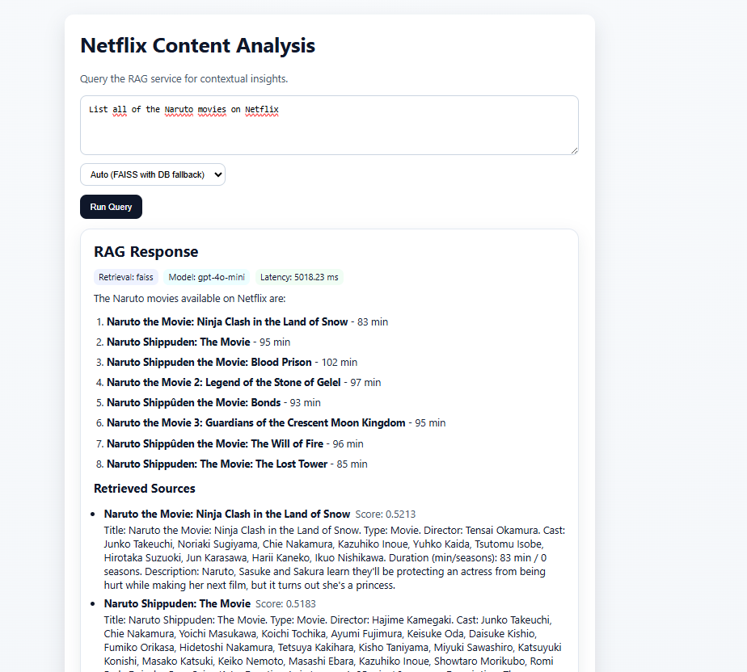
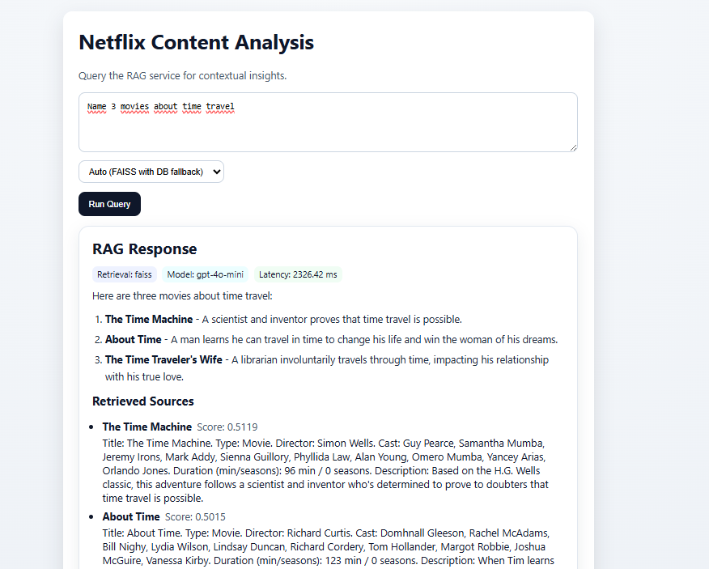
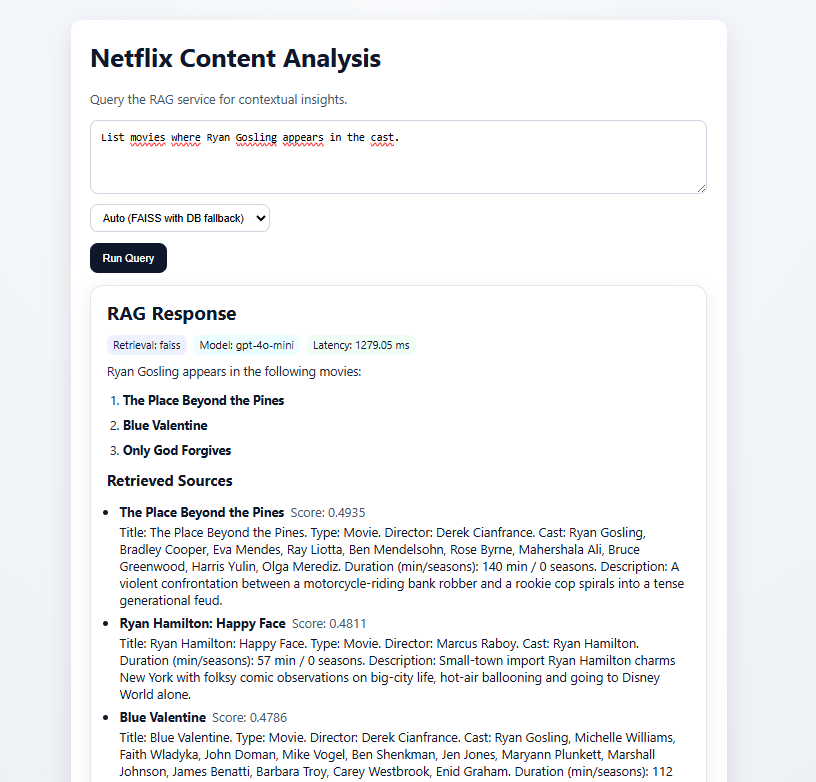

# Netflix Content Analysis with RAG

Production-ready full-stack Retrieval-Augmented Generation (RAG) application for Netflix content analytics.

- Full RAG + LLM flow in `POST /api/v1/rag/query`:
	- retrieval (`faiss`, `db`, or `auto` fallback)
	- context-aware prompt building
	- final answer generation using OpenAI chat model
- Query response metadata:
	- `retrieval_mode_used`
	- `latency_ms`
	- `model`
- Improved indexing in `POST /api/v1/rag/index`:
	- uses precomputed embeddings when provided
	- batch-generates missing embeddings asynchronously
	- partial failure reporting (`failed_count`, `failed_items`)
- Build manager endpoints:
	- `POST /api/v1/rag/build` (background embedding/index build)
	- `GET /api/v1/rag/build/{job_id}` (status)
- Build job persistence in DB (`index_jobs` table).
- Readiness + metrics + rate limiting:
	- `/api/v1/ready`
	- `/api/v1/metrics`
	- in-memory route rate limits for expensive endpoints

## Features

- FastAPI backend with dual retrieval support:
	- `faiss` (fast vector search)
	- `db` (database embedding similarity)
	- `auto` (default: FAISS with DB fallback)
- OpenAI-powered generation in `/api/v1/rag/query`.
- Optional precomputed embedding ingestion via `/api/v1/rag/index`.
- Async batch embedding generation with retry/backoff and partial failure reporting.
- Build pipeline endpoint for generating CSV embeddings + FAISS index.
- React frontend for querying and selecting retrieval mode.
- Production frontend image serving static assets via Nginx.
- Health/readiness/metrics endpoints:
	- `/api/v1/health`
	- `/api/v1/ready`
	- `/api/v1/metrics`

## Dynamic Retrieval (top-k)

Dynamic retrieval adapts the number of documents returned by the retriever based on the user's query. Instead of using a fixed top-k, the system analyzes the query to choose an appropriate retrieval window. This helps reduce missed context and improves the chance that the generation model receives relevant information for complex requests.

Rules (current):
- minimum `top_k` is always `10`
- if query contains `all`, `top_k = 50`
- if query contains a number `k`, `top_k = min(k * 2, 50)` with minimum still `10`
- broad intents like list/show/similar use wider retrieval windows

Examples:
- `"Naruto 2"` -> `10` (minimum guard)
- `"List 10 shows"` -> `20`
- `"List all movies"` -> `50` (max retrieval)

This behavior is enabled by the `determine_top_k(query: str) -> int` helper which applies simple, explainable heuristics.

## Example Query Screenshots


### Screen 1



### Screen 2



### Screen 3



## Environment Variables

Minimum required:

- `OPENAI_API_KEY`

Useful optional settings:

- `OPENAI_CHAT_MODEL` (default: `gpt-4o-mini`)
- `OPENAI_EMBEDDING_MODEL` (default: `text-embedding-3-small`)
- `RETRIEVAL_DEFAULT_MODE` (`auto` / `faiss` / `db`)
- `FAISS_INDEX_PATH` (default: `data/netflix.faiss`)
- `FAISS_METADATA_CSV_PATH` (default: `data/netflix_with_embeddings.csv`)

## Quick Start (Docker)

1. Set environment variables in `.env` (at minimum `OPENAI_API_KEY`).
2. Build and run:

```bash
docker compose up --build
```

3. Backend API: `http://localhost:8000`
4. Frontend: `http://localhost:5173`

Swagger docs: `http://localhost:8000/docs`

## API Endpoints

- `POST /api/v1/rag/query`
	- body:
		- `question: string`
		- `retrieval_mode: auto | faiss | db`
	- response:
		- `answer`
		- `sources[]`
		- `retrieval_mode_used`
		- `latency_ms`
		- `model`

- `POST /api/v1/rag/index`
	- supports optional `embedding` per item
	- returns `indexed_count`, `failed_count`, `failed_items`

- `POST /api/v1/rag/build`
	- starts background embeddings + FAISS build

- `GET /api/v1/rag/build/{job_id}`
	- returns build status and details

- `GET /api/v1/health`
- `GET /api/v1/ready`
- `GET /api/v1/metrics`

## Data and Embeddings

1. Build embeddings and FAISS index:

```bash
python backend/scripts/build_embeddings.py --input data/netflix_for_embeddings.csv --out-csv data/netflix_with_embeddings.csv --faiss-out data/netflix.faiss --batch 100
```

2. Upload to DB with precomputed embeddings:

```bash
python backend/scripts/upload_embeddings_to_db.py --csv data/netflix_with_embeddings.csv --batch 200
```

## Testing

Backend:

```bash
cd backend
pytest -q
```

Frontend:

```bash
cd frontend
npm run test
```
